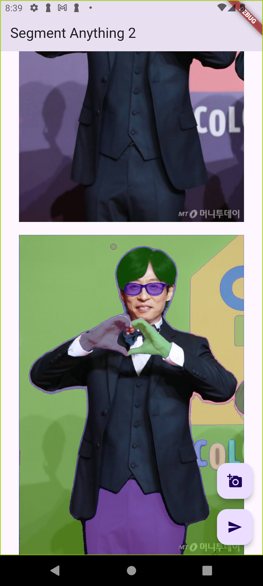
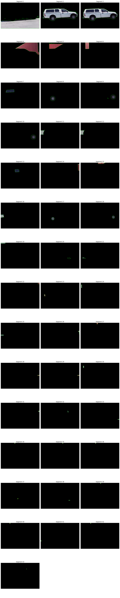

# Quest03

- PROJECT 6-1. 프로젝트

Segment Anything 2 사용한 플러터 앱 연동

플러터

*main.dart*

파이썬

*server_fastapi.py*

- 회고

SAM2를 설치하는데 오래 걸렸지만, 분리하면 무적일 줄 알았다!
그러나, 원하는대로 분류해주는 것이 아니었고, 또 원하는대로 분류하려면 추가적인 과정이 필요했음. 
SAM2에는 이미지, 영상, 마스크 제너레이터를 만들 수 있는데, 모델이 어떤 변수를 사용하는지 잘 알아야 응용 또한 잘 할 수 있겠다 싶습니다.

- 이미지(2)

**앱 연동 사진, 백엔드 진행 사진**

