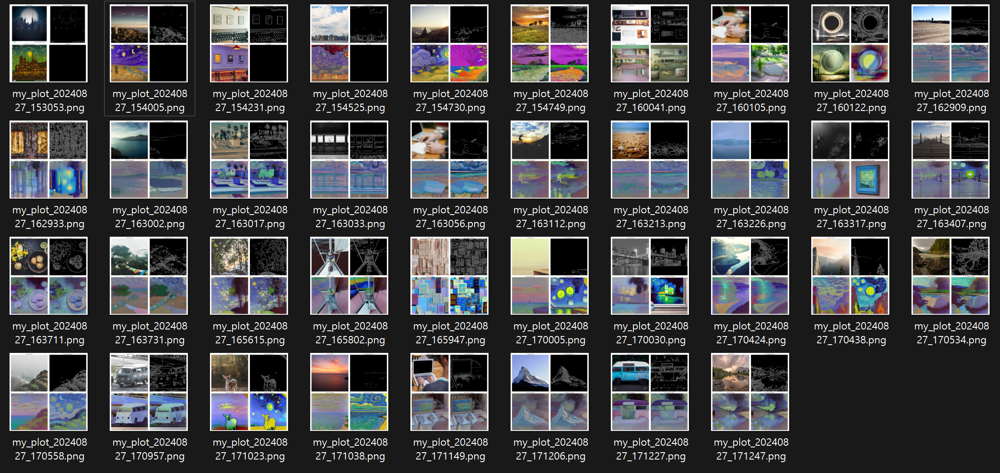
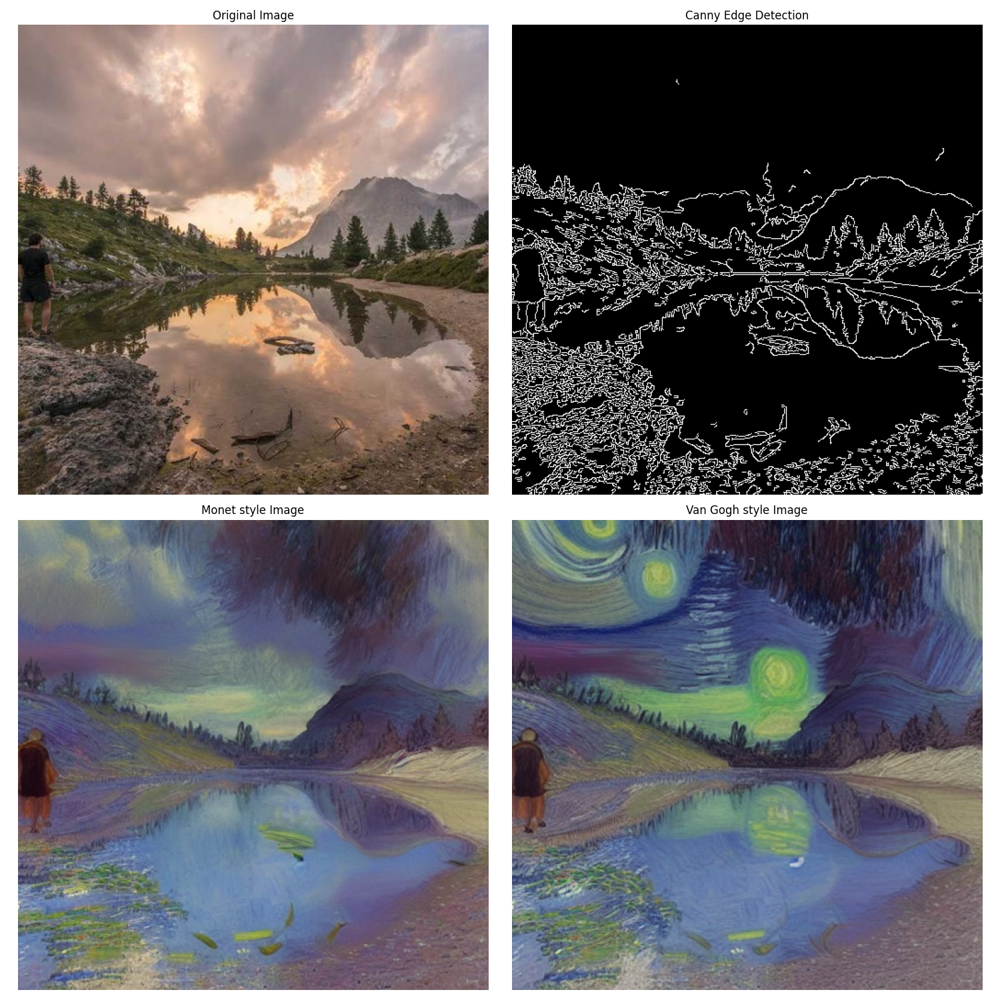

## EXPLORATION 06

#### Stable Diffusion 

팀 : 김기홍, 강대식

#### 회고

대식

- 진행 중 다음의 에러가 발생했으며 RuntimeError: CUDA out of memory가 가장 많이 발생하였습니다.
- 메모리 관리가 제한적이어서 이 문제 발생 시 반복적으로 다시 진행해야 하는 문제가 있었습니다.
- 마지막 부분인 “**Edge Detection과 Openpose, 2개의 전처리기를 `controlnets`라는 리스트로 만들어 파이프라인으로 전달합니다.”**에서 에러로 이미지 출력을 못 시키지 못 했습니다.  
- 코드의 내용과 메모리 관리에 대한 정확한 이해를 통해 해결이 필요한 상황입니다.

1. **RuntimeError: CUDA out of memory.** 
2. /opt/conda/lib/python3.9/site-packages/transformers/tokenization_utils_base.py:1601: FutureWarning: `clean_up_tokenization_spaces` was not set. It will be set to `True` by default. This behavior will be depracted in transformers v4.45, and will be then set to `False` by default. For more details check this issue: https://github.com/huggingface/transformers/issues/31884
3. NameError: name 'openpose_image' is not defined
4. `FileNotFoundError: [Errno 2] No such file or directory: 'aiffel/aiffel/multi_controlnet_output.png'`

기홍

1. fast api 사용해서 앱생성 및 결과 파일 저장했는데, 모델전처리나, 프롬프트 엔지니어링이 꽤 중요한 역할을 한다는 것을 확인
2. 작업을 진행하며 여러 자동화를 위한 노력을 많이함. api를 어떻게 쉽게 가져와서 자동화를 시킬 수 있는지, 또 프롬프트도 자동화 시킬 수 있으면 좋겠다는 생각이 들었습니다.
3. 시간의 압박에 많은 부분을하지는 못했지만, 스테이블 디퓨전을 잘 사용하면 여러 분야에 응용할 수 있겠다는 자신감을 갖음. 
4. guidance_scale( 1.0에서 20.0 사이의 값), image_strength(0에서 1사이의 값) 를 변화시키면서 이미지 생성했을때 
    - guidance_scale 낮을수록 이미지 생성이 자유롭고 창의적. 높을수록 이미지가 프롬프트에 충실함.
    - image_strength 낮을수록 원본이미지의 특성이 사라짐. 프롬프트의 영향력 증가.
5. 앱을 잘 만들기 위해선 fastapi(Backend)에서 모듈화를 잘 할수 있도록 고민을 잘 해야 그만큼 보기좋고, 서로 잘 공유할 수 있는 코드를 짤 수 있겠다는 생각이 듬.

### 제작 앱 이미지

### 결과물

