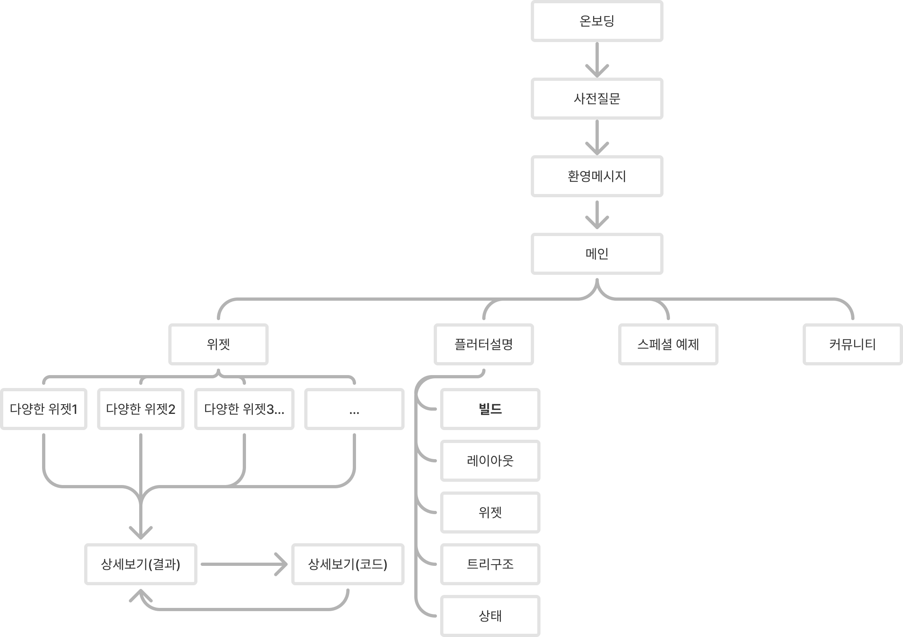
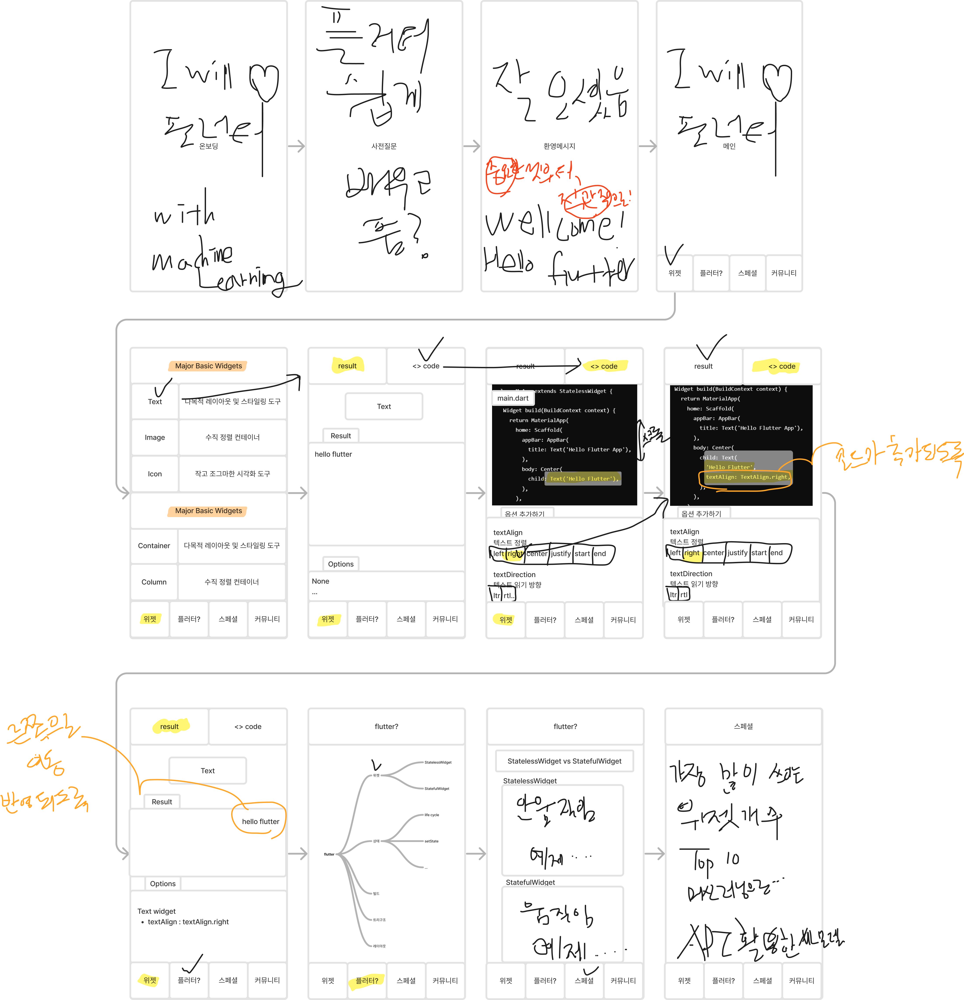
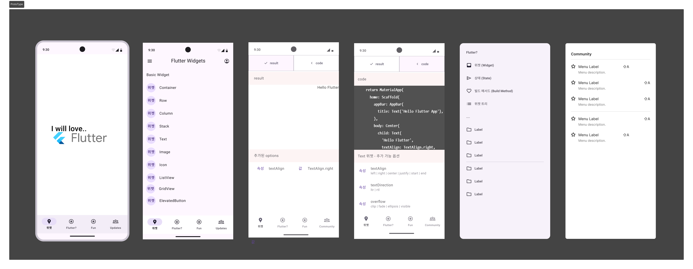

# 앱 제작을 위한 구조도, 와이어프레임, 프로토타입 진행

## 앱 정보

- **앱 이름**

  - I will love flutter.

- **타겟**

  - 플루터 앱을 배우고싶어하는 사람. 혹은 쉽게 코드를 사용하고 싶어하는 이들!

## 앱 구조도

## 앱 와이어프레임 (사용 툴 : FIGMA)

## 프로토타이핑 (사용 툴 : FIGMA)

[피그마 프로토타입 재생 링크](https://www.figma.com/proto/vEGlcVKdMtIo8ilziPuiup/first_project?t=PhHVAPRtWCl5VTn4-1)

## 참고 학습 자료

유튜브 디자인베이스 피그마 강좌 (https://www.youtube.com/watch?v=tWPskJZQb5E&list=PLkbzizJk4Ae9L-n9yEquO9T927speoMWd)

## 회고

FIGMA가 정말 좋은 툴임을 알게되었지만, 익숙하게 사용할 수 있도록 배움과 적용의 시간이 더 필요할 것 같다.
아마 더 욕심을 내고싶었지만, 생각처럼 움직이지 않고, 복잡한 기능들이 많아서 러닝커브가 있는 것 같다.

와이어프레임 및 프로토타입을 만들어보면서 시행착오를 미리할 수 있어서 참 좋았던 것 같고,
어떤 부분을 생각해야하는지 더 구체적이고 생각보다 미리 만들어보면서 스스로 질문하는 시간이 많았다.
어떤 방식으로 레이아웃을 설계할 것인지, 기능은 구체적으로 어떻게 실행하며, 화면의 이동에 대해서도 고민해보며
미리 프로토타입을 만들어보는 것이 마치 제작 전에 미리 설계를 해보며 요구사항을 점검하는 좋은 시간이라 생각했다.
flutter로 앱을 만들기를 하며 머신러닝까지 어떻게 넣어야할지 생각해보는 귀한 시간이었습니다.

플러터 앱을 실제로 만드는 것은 생각보다 시간이 필요했는데 역시 무언가를 직접 만들어봐야 머리로만 아는것에서 그치지 않고,
적용하고, 응용하고, 찾으면서 살아있는 공부가 되는 것 같습니다.
감사합니다.
